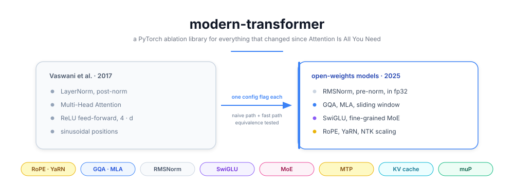
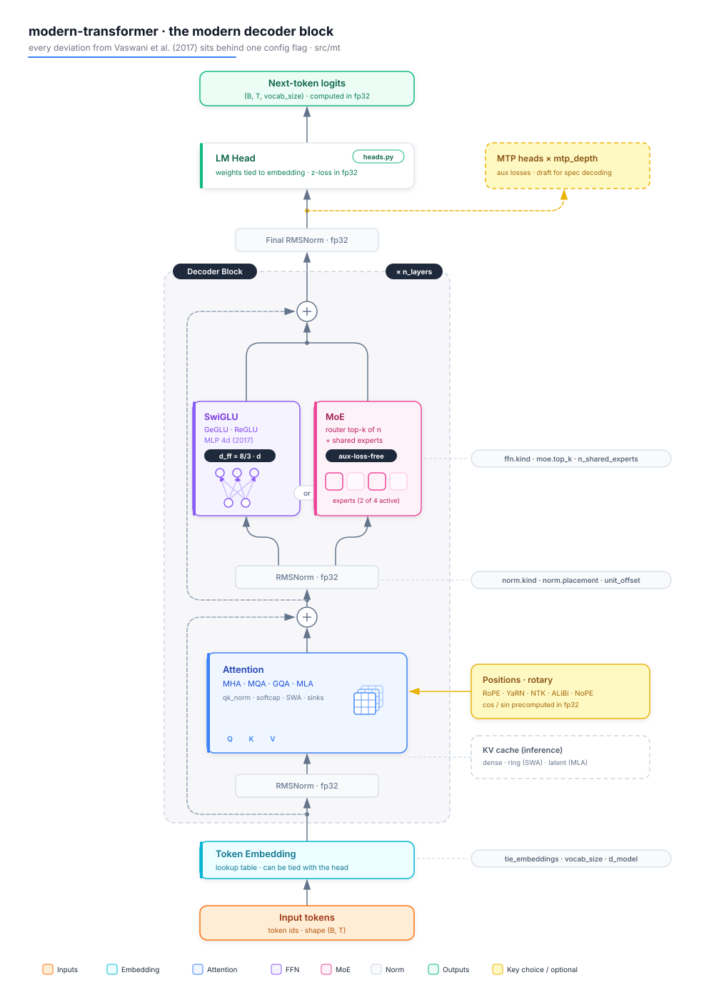

# 🧬 modern-transformer


<p align="center">
  
</p>

## 📝 Project Description

Nobody trains the Transformer of **Vaswani et al. (2017)** anymore. Every open-weights model released since **LLaMA** replaced its normalization, its positions, its attention and its feed-forward, one paper at a time. This library rebuilds those deviations in **PyTorch**, each one behind a config flag, so they can be switched on and off and compared.

It is an **ablation library, not a model**. Every component ships with a **naive reference implementation** (readable, slow) plus the fast path, and a numerical equivalence test between the two. That equivalence test is the whole point, it is what separates a reference implementation from a plausible one.

The goal is to answer a question that papers rarely answer directly: **which of these techniques actually earn their complexity, and at what scale**.

🚨 **Work in progress.** Milestones M0 to M6 are done and green, so the library trains and generates end to end today. Benchmarks and the ablation table land in M7, see the roadmap below.

---

## ⚙️ Features

  🧩 **One config flag per deviation**, so a single field separates two runs that are otherwise identical

  🔬 **Naive path and fast path for every component**, with an equivalence test between them

  📐 **Five coherent profiles** shipped in `configs/`, from the vanilla 2017 block to a Gemma-style alternated model

  🚫 **No config activates everything at once**, because a model that stacks every brick is the counter-example this repo teaches against

  📄 **29 reference papers downloaded and indexed**, each module docstring citing its authors, year and arXiv id

  🎯 **Validation that fails loudly**, a typo in a YAML file raises instead of being silently ignored

  🧪 **Whole test suite runs on CPU in under 4 seconds**, so ablations stay cheap to check

---

## 🗂️ The deviations, one block of the 2017 architecture at a time

Each table below is one box of the original figure. For every component: what it
replaces, the paper it comes from, **what it actually optimizes**, and the flag
that switches it on.

**What the tags mean**

| Tag | Optimizes | The question it answers |
|---|---|---|
| 💾 | **Memory** | how much VRAM does one token of context cost |
| ⚡ | **Compute and energy** | how many FLOPs, or how fast at fixed FLOPs |
| 🎯 | **Quality** | better loss at an equal parameter or FLOP budget |
| 🛡️ | **Training stability** | does the run survive, and without babysitting |
| 📏 | **Long context** | does it still work past the training length |
| 🔧 | **Hyperparameter transfer** | can small model settings be reused at scale |

---

### 🟠 Input embedding

| Component | Replaces | Paper | Optimizes | Config flag |
|---|---|---|---|---|
| **Byte-level BPE, large vocabulary** | BPE 32k to 37k | GPT-2, 2019 | ⚡ 🎯 | upstream of `mt` |
| **Tied embeddings** | a separate output matrix | Press and Wolf, 2016 ([1608.05859](https://arxiv.org/abs/1608.05859)) | 💾 | `model.tie_embeddings` |

*A larger vocabulary means fewer tokens for the same text, so fewer forward passes. It costs a bigger embedding table, which is exactly why tying matters more the smaller the model.*

---

### 🟡 Positional encoding

*2017: a fixed sinusoidal signal added to the embedding once, at the input. Position is absolute and competes with content inside the residual stream, where it dilutes with depth.*

| Component | Replaces | Paper | Optimizes | Config flag |
|---|---|---|---|---|
| **RoPE** | sinusoidal absolute embeddings | Su et al., 2021 ([2104.09864](https://arxiv.org/abs/2104.09864)) | 🎯 📏 | `position.kind: rope` |
| **ALiBi** | any positional embedding | Press et al., 2021 ([2108.12409](https://arxiv.org/abs/2108.12409)) | 📏 | `position.kind: alibi` |
| **NoPE** | any positional embedding | Kazemnejad et al., 2023 ([2305.19466](https://arxiv.org/abs/2305.19466)) | 🎯 | `position.kind: nope` |
| **theta 10k to 500k** | theta fixed at 10000 | LLaMA 3, 2024 ([2407.21783](https://arxiv.org/abs/2407.21783)) | 📏 | `position.rope_theta` |
| **Position Interpolation** | nothing, 2017 had no extension | Chen et al., 2023 ([2306.15595](https://arxiv.org/abs/2306.15595)) | 📏 | `scaling.kind: linear` |
| **NTK-aware, dynamic NTK** | nothing | community, then LLaMA 3 | 📏 | `scaling.kind: ntk-aware` |
| **YaRN** | nothing | Peng et al., 2023 ([2309.00071](https://arxiv.org/abs/2309.00071)) | 📏 🎯 | `scaling.kind: yarn` |

*RoPE rotates q and k at **every layer**, so the dot product depends only on `m - n`. RoPE alone does not extend context, it generalizes poorly past its training length. Everything from Position Interpolation down exists to patch that one problem afterwards.*

---

### 🔵 Multi-Head Attention

*2017: 8 heads, each with its own K and V projection. Everything below changed for the KV cache, not for quality.*

**Head layout**

| Component | Replaces | Paper | Optimizes | Config flag |
|---|---|---|---|---|
| **MQA** | one KV pair per query head | Shazeer, 2019 ([1911.02150](https://arxiv.org/abs/1911.02150)) | 💾 ⚡ | `attention.kind: mqa` |
| **GQA** | one KV pair per query head | Ainslie et al., 2023 ([2305.13245](https://arxiv.org/abs/2305.13245)) | 💾 ⚡ | `attention.kind: gqa` |
| **MLA** | the KV cache itself, now a latent vector | DeepSeek-V2, 2024 ([2405.04434](https://arxiv.org/abs/2405.04434)) | 💾 | `attention.kind: mla` |

**Score computation**

| Component | Replaces | Paper | Optimizes | Config flag |
|---|---|---|---|---|
| **QK-Norm** | raw q and k, whose logits drift upward | Henry et al., 2020 ([2010.04245](https://arxiv.org/abs/2010.04245)) | 🛡️ | `attention.qk_norm` |
| **Logit softcapping** | unbounded attention logits | Gemma 2, 2024 ([2408.00118](https://arxiv.org/abs/2408.00118)) | 🛡️ | `attention.logit_softcap` |
| **Sliding window** | full quadratic attention on every layer | Mistral 7B, 2023 ([2310.06825](https://arxiv.org/abs/2310.06825)) | ⚡ 📏 | `attention.sliding_window` |
| **Local and global alternation** | all layers identical | Gemma 3, 2025 ([2503.19786](https://arxiv.org/abs/2503.19786)) | ⚡ 📏 | `attention.global_every` |
| **Attention sinks** | evicting the first tokens | Xiao et al., 2023 ([2309.17453](https://arxiv.org/abs/2309.17453)) | 🛡️ 📏 | `attention.attn_sinks` |
| **FlashAttention** | nothing mathematically, only memory traffic | Dao et al., 2022 ([2205.14135](https://arxiv.org/abs/2205.14135)) | ⚡ 💾 | `[flash]` extra, or SDPA |

*Decoding one token reads the whole cache and does little arithmetic with it, so the step is bound by memory bandwidth. Dividing the cache by four roughly divides decode time by four, which is the clearest case here where a memory win buys speed. Measured cost per variant is in the table further down.*

---

### ⚪ Add & Norm

*2017: `LayerNorm(x + Sublayer(x))`, that is post-norm. A normalization sits on the residual path itself, which is why the original needed a 4000 step warmup.*

| Component | Replaces | Paper | Optimizes | Config flag |
|---|---|---|---|---|
| **Pre-norm** | post-norm, which needs warmup to train | Xiong et al., 2020 ([2002.04745](https://arxiv.org/abs/2002.04745)) | 🛡️ | `norm.placement: pre` |
| **RMSNorm** | LayerNorm, drops the mean and the bias | Zhang and Sennrich, 2019 ([1910.07467](https://arxiv.org/abs/1910.07467)) | ⚡ 🛡️ | `norm.kind: rmsnorm` |
| **Sandwich norm** | a single norm per sub-block | Gemma 2, 2024 ([2408.00118](https://arxiv.org/abs/2408.00118)) | 🛡️ | `norm.placement: sandwich` |
| **Scaled residual init** | uniform init, whose variance grows with depth | GPT-2, 2019 | 🛡️ | `init.scaled_residual` |
| **DyT** | normalization entirely | Zhu et al., 2025 ([2503.10622](https://arxiv.org/abs/2503.10622)) | ⚡ | `norm.kind: dyt` |

*One thing here is not optional. Every statistic must be computed in fp32 and cast back, and this repo verifies that `torch.nn.functional.rms_norm` does not do it.*

---

### 🟣 Feed Forward

*2017: `max(0, xW₁ + b₁)W₂ + b₂` with `d_ff = 4·d`. Two thirds of the parameters of a block live here. Two independent changes happened, answering different questions.*

| Component | Replaces | Paper | Optimizes | Config flag |
|---|---|---|---|---|
| **SwiGLU, GeGLU, ReGLU** | the ReLU feed-forward of width 4·d | Shazeer, 2020 ([2002.05202](https://arxiv.org/abs/2002.05202)) | 🎯 | `ffn.kind` |
| **Sparse MoE** | one dense feed-forward per layer | Shazeer et al., 2017 ([1701.06538](https://arxiv.org/abs/1701.06538)) | 🎯 at fixed ⚡ | `moe.enabled` |
| **Fine-grained experts** | a few large experts | DeepSeekMoE, 2024 ([2401.06066](https://arxiv.org/abs/2401.06066)) | 🎯 | `moe.n_experts` |
| **Shared experts** | routing everything, duplicating common knowledge | DeepSeekMoE, 2024 ([2401.06066](https://arxiv.org/abs/2401.06066)) | 🎯 | `moe.n_shared_experts` |
| **Auxiliary loss** | nothing, without it the router collapses | Switch, 2021 ([2101.03961](https://arxiv.org/abs/2101.03961)) | 🛡️ | `moe.balance: aux_loss` |
| **Aux-loss-free balancing** | the auxiliary loss, which fights the real one | DeepSeek-V3, 2024 ([2408.15664](https://arxiv.org/abs/2408.15664)) | 🛡️ 🎯 | `moe.balance: aux_loss_free` |
| **Router z-loss** | unbounded router logits | ST-MoE, 2022 ([2202.08906](https://arxiv.org/abs/2202.08906)) | 🛡️ | `moe.router_z_loss_coef` |

*A gated unit uses three matrices instead of two, so the width drops from `4d` to `8/3·d` to keep the parameter budget. MoE buys quality per FLOP and pays in memory, since every expert stays resident while only a few run. Below a few billion parameters on one GPU it buys nothing.*

---

### 🟢 Output head and objective

| Component | Replaces | Paper | Optimizes | Config flag |
|---|---|---|---|---|
| **Output z-loss** | unbounded logits, which bf16 loses | ST-MoE, 2022 ([2202.08906](https://arxiv.org/abs/2202.08906)) | 🛡️ | `train.z_loss_coef` |
| **Multi-Token Prediction** | predicting one next token | Gloeckle et al., 2024 ([2404.19737](https://arxiv.org/abs/2404.19737)) | 🎯 ⚡ | `model.mtp_depth` |

---

### 🔧 Optimization

*Not part of the architecture, but the 2017 recipe changed completely.*

| Component | Replaces | Paper | Optimizes | Config flag |
|---|---|---|---|---|
| **AdamW, betas (0.9, 0.95)** | Adam with beta2 0.98 and plain L2 | Loshchilov and Hutter, 2017 ([1711.05101](https://arxiv.org/abs/1711.05101)) | 🛡️ 🎯 | `train.betas` |
| **Decay excluding norms and biases** | decay on every parameter | current practice | 🎯 | `train.weight_decay` |
| **Warmup plus cosine** | the inverse square root schedule | GPT-3, 2020 | 🛡️ | `train.schedule: cosine` |
| **WSD** | cosine, which locks the token budget upfront | MiniCPM, 2024 ([2404.06395](https://arxiv.org/abs/2404.06395)) | 🔧 | `train.schedule: wsd` |
| **muP** | retuning the learning rate at every width | Yang et al., 2022 ([2203.03466](https://arxiv.org/abs/2203.03466)) | 🔧 | `mup.enabled` |
| **bf16 with fp32 master weights** | fp32 everywhere | Micikevicius et al., 2017 ([1710.03740](https://arxiv.org/abs/1710.03740)) | ⚡ 🛡️ | `train.precision` |

---

### ⏩ Inference

*Absent from the 2017 paper, which never discusses autoregressive decoding cost.*

| Component | Replaces | Paper | Optimizes | Config flag |
|---|---|---|---|---|
| **KV cache** | recomputing the prefix at every token | standard practice | ⚡ | `cache.py` |
| **Ring buffer cache** | a dense cache on windowed layers | Mistral 7B, 2023 ([2310.06825](https://arxiv.org/abs/2310.06825)) | 💾 | `cache.RingCache` |
| **Latent cache** | storing every KV head | DeepSeek-V2, 2024 ([2405.04434](https://arxiv.org/abs/2405.04434)) | 💾 | `cache.LatentCache` |
| **Speculative decoding** | one forward pass per generated token | Leviathan et al., 2022 ([2211.17192](https://arxiv.org/abs/2211.17192)) | ⚡ | `generate.py` |

*Correct rejection sampling makes speculative decoding produce **exactly** the target model distribution, so it is free speed rather than a quality trade.*

---

The full index, with one PDF per line and the milestone that implements it, lives in [papers/_INDEX.md](papers/_INDEX.md).

📚 **[docs/taxonomy.md](docs/taxonomy.md) sorts all of these by slot and by function**, meaning which part of the 2017 block they replace (tokenizer, positions, attention heads, score computation, add and norm, feed-forward, head, optimizer, inference) and which constraint they were invented for (memory, compute, quality, stability, long context, hyperparameter transfer). It ends with a "pick by constraint, not by slot" table, which is the one to read when choosing what goes into a model.

---

## Example Outputs

The M0 test suite, which validates the config schema and every shipped profile:

```
tests\test_config.py .................                                   [ 68%]
tests\test_configs_load.py ......                                        [ 92%]
tests\test_seed.py ..                                                    [100%]

============================= 25 passed in 3.24s ==============================
```

The five profiles, each one a coherent selection rather than a pile of features:

| Profile | Attention | Positions | Norm | FFN |
|---|---|---|---|---|
| `base.yaml` | MHA | sinusoidal | LayerNorm, post | ReLU, 4·d |
| `llama_style_150m.yaml` | GQA 16 / 4 | RoPE, theta 500k | RMSNorm, pre | SwiGLU |
| `moe_1b_a200m.yaml` | GQA 16 / 4 | RoPE | RMSNorm, pre | MoE, 64 experts, top 6 |
| `mla_long_ctx.yaml` | MLA, rank 512 | RoPE + YaRN ×4 | RMSNorm, pre | SwiGLU |
| `gemma_style.yaml` | GQA + sliding window | RoPE | RMSNorm, sandwich | GeGLU |

### 📝 Notes and observations

  🧮 **What the KV cache actually costs.** From `bench/kv_memory.py`, on a 32 layer model with `d_model` 4096 and 32 heads, serving 32k of context at batch 8 in fp16:

| variant | bytes/token | total cache | vs MHA |
|---|---|---|---|
| MHA | 512.0 KB | 128.0 GB | 1.0x |
| GQA g=4 | 128.0 KB | 32.0 GB | 4.0x |
| GQA g=8 | 64.0 KB | 16.0 GB | 8.0x |
| MLA | 36.0 KB | 9.0 GB | 14.2x |
| MQA | 16.0 KB | 4.0 GB | 32.0x |
| SWA w=4096 (GQA g=4) | 128.0 KB | 4.0 GB | bounded |

MHA at this context does not fit on any single machine, which is the whole reason this slot changed. Note the sliding window row: its cost per token is unchanged, the saving comes entirely from the cache no longer growing past the window. And MLA is not free memory, it beats a dense cache only below 2.2 KV heads at this head dim, so MQA is still smaller.

  🔎 **`F.rms_norm` cannot be used as a fast path.** In torch 2.5.1 it computes in the input dtype, and in fp16 it matches an all-fp16 computation bit for bit rather than the fp32 one. A test locks this in and will fail the day torch fixes it, see `test_torch_rms_norm_does_not_upcast`.

  🧭 **What context extension actually buys, measured.** Training at 2048 and serving at 8192, the slowest RoPE band reaches 1.0924 rad instead of the 0.2731 rad it ever saw, so it is extrapolating into unseen angles. Position Interpolation and YaRN both bring it back to exactly 0.2731. The difference is the cost: PI squashes all 32 frequency bands, YaRN leaves 9 of them untouched because they already completed enough periods during training. Its attention temperature comes out at 1.1386, which is `0.1 · ln(4) + 1`.

  📉 **muP is width invariant to 1.03x, standard init to 31.63x.** Measured by the coordinate check over `d_model` in 128 to 1024 on the real model, see [docs/mup_coord_check.md](docs/mup_coord_check.md). Running it on a stand-in MLP instead gave 1.31x, so a coordinate check really has to measure the model you run.

  ⚠️ **bf16 is requested, fp16 is used.** On a compute capability 7.5 GPU `is_bf16_supported()` returns True while bf16 is emulated and slower. `mt.utils.numerics.resolve_precision` detects this and falls back, printing why.

  ⚠️ **bf16 is not free on every GPU.** A GTX 1660 Ti reports `is_bf16_supported() == True`, but that is emulation, the compute capability is 7.5. The local profiles therefore use fp16, and bf16 is kept for the pod-sized MoE profile.

  🎛️ **The defaults of the schema are the modern baseline** (GQA, RoPE, RMSNorm pre-norm, SwiGLU, no bias). The 2017 model is not a default that got overridden, it lives entirely inside `base.yaml`.

---

## ⚙️ How it works

  🧾 **Everything starts from a config.** Nested Pydantic models describe the architecture, and `extra="forbid"` turns a YAML typo into an immediate error instead of a silently ignored key.

  ✅ **Validation runs across fields, not just types.** `n_heads` must be a multiple of `n_kv_heads`, MLA refuses an explicit `n_kv_heads` because its latent cache replaces KV heads, a sliding window is required before layers can alternate, and MTP needs tied embeddings because it shares the LM head.

  🧱 **One `Attention` class, not one class per variant.** MHA, MQA, GQA and MLA are dispatched internally, which is what makes an ablation a single field change.

  🔍 **Each component is written twice.** The naive version reads like the paper, the fast version uses `F.scaled_dot_product_attention`, and a test asserts they agree numerically.

  🌡️ **fp32 where it is not negotiable.** Normalization, the RoPE cos and sin tables, and the softmax and logits are computed in fp32 then cast back, which is the number one source of bf16 divergence.

  📊 **Metrics that catch silent failures.** Router entropy, per-expert token share and drop rate are logged for MoE, because a router collapse is invisible in the loss curve alone.

---

## 🗺️ Architecture Diagram

The decoder block, with every switchable component and the config flag that controls it:



**Default socle** (what you get without asking for anything):

- RoPE, `theta = 10000` (500000 for long context)
- GQA with `n_kv_heads = n_heads / 4`
- RMSNorm, pre-norm, computed in fp32
- SwiGLU with `d_ff = round(8/3 · d, 256)`
- No bias on the linears or the norms, tied embeddings
- Output projections divided by `sqrt(2 · n_layers)` at init
- AdamW `betas = (0.9, 0.95)`, weight decay 0.1 excluded from norms, biases and embeddings

---

## 🛣️ Roadmap

| Milestone | Content | Status |
|---|---|---|
| **M0** | Config schema, five profiles, determinism, test harness | ✅ done, 25 tests green |
| **M1** | LayerNorm, RMSNorm, QK-Norm, DyT, scaled residual init, muP | ✅ done, 54 tests green |
| **M2** | RoPE and its two conventions, YaRN, NTK, ALiBi, NoPE | ✅ done, 96 tests green |
| **M3** | MHA, MQA, GQA, MLA with weight absorption, masks, KV caches | ✅ done, 150 tests green |
| **M4** | SwiGLU family, fine-grained MoE, balancing, MTP heads | ✅ done, 197 tests green |
| **M5** | Model assembly, optimizer groups, WSD schedule, training loop | ✅ done, 269 tests green |
| **M6** | Sampling, incremental decoding, speculative decoding | ✅ done, 297 tests green |
| **M7** | Benchmarks (KV memory, throughput) and the ablation table | ⏳ |

---

## 📂 Repository structure

```bash
├── assets/                      # For the README
│   ├── banner.svg
│   └── architecture.svg
│
├── configs/                     # One coherent profile per file, never everything at once
│   ├── base.yaml                # vanilla 2017, the zero-ablation reference
│   ├── llama_style_150m.yaml    # RoPE + GQA + RMSNorm + SwiGLU
│   ├── moe_1b_a200m.yaml        # fine-grained MoE + shared experts + aux-loss-free
│   ├── mla_long_ctx.yaml        # MLA + YaRN + attention sinks
│   └── gemma_style.yaml         # alternated local and global attention + QK-norm + softcap
│
├── src/mt/
│   ├── config.py                # Pydantic schema, all the cross-field validation
│   ├── model.py                 # Transformer, Block, forward and losses          ✅
│   ├── layers/
│   │   ├── norm.py              # LayerNorm, RMSNorm, QK-Norm, DyT, placements    ✅
│   │   ├── pos.py               # RoPE, PI, NTK, YaRN, ALiBi, NoPE                ✅
│   │   ├── attention.py         # MHA / MQA / GQA / MLA, SWA, sinks, softcap      ✅
│   │   ├── ffn.py               # MLP, SwiGLU, GeGLU, ReGLU                       ✅
│   │   ├── moe.py               # router, experts, shared experts, balancing      ✅
│   │   └── heads.py             # LM head, tied embeddings, MTP heads             ✅
│   ├── cache.py                 # dense KV cache, SWA ring buffer, MLA latent     ✅
│   ├── init.py                  # standard init, scaled residual init, muP        ✅
│   ├── optim.py                 # AdamW, param groups, WSD and cosine, z-loss     ✅
│   ├── train.py                 # minimal training loop, grad accum, checkpoints  ✅
│   ├── generate.py              # sampling, KV cache, speculative decoding        ✅
│   └── utils/
│       ├── seed.py              # set_determinism
│       └── numerics.py          # fp32 policy, precision fallback              ✅
│
├── tests/                       # Equivalence tests, naive path against fast path
│   ├── test_config.py
│   ├── test_configs_load.py
│   └── test_seed.py
│
├── papers/                      # 29 reference PDFs, gitignored
│   ├── _INDEX.md                # paper, component, config flag, milestone
│   └── download.sh              # restores the PDFs after a clone
│
├── bench/                       # KV memory, throughput, ablations                (M7)
├── docs/                        # ablations.md, mup_coord_check.md                (M7)
│
├── pyproject.toml
├── LICENSE
└── README.md
```

---

## 💻 Run it on Your PC

Clone the repository and install dependencies:

```bash
git clone https://github.com/Thibault-GAREL/modern-transformer.git
cd modern-transformer

python -m venv .venv # if you don't have a virtual environment
source .venv/bin/activate   # Linux / macOS
.venv\Scripts\activate      # Windows

pip install -e ".[dev]"
```

⚠️ The default install pulls the CPU build of PyTorch. For a **CUDA-compatible GPU**, install torch first:

```bash
pip install torch==2.5.1 --index-url https://download.pytorch.org/whl/cu121
pip install -e ".[dev]"
```

### Run the tests

```bash
pytest
```

### Train a model

```bash
python -m mt.train --config configs/llama_style_150m.yaml --max-steps 200
```

Any config field can be overridden from the command line, which is how the
shipped profiles are shrunk to fit a smaller GPU:

```bash
python -m mt.train --config configs/moe_1b_a200m.yaml   --set model.d_model=128 --set model.moe.n_experts=8 --max-steps 100
```

Every loss term is logged separately to `metrics.jsonl`, plus the routing
entropy and per-expert load on MoE layers. Merging them into one number is how
a collapsing router goes unnoticed.

### Load a profile

```python
from mt.config import Config

cfg = Config.from_yaml("configs/llama_style_150m.yaml")
print(cfg.model.attention.kind, cfg.model.head_dim)   # gqa 64
```

### Generate

```python
from mt.generate import SamplingConfig, generate, speculative_generate

out = generate(model, prompt_ids, 128, SamplingConfig(temperature=0.8, top_p=0.9))

# same output distribution as the target model, verified statistically
out, stats = speculative_generate(target, draft, prompt_ids, 128, gamma=4)
print(stats.acceptance_rate)
```

### Get the reference papers

The PDFs are gitignored because they are heavy, this restores all 29 of them:

```bash
bash papers/download.sh
```

---

## 📖 Inspiration / Sources

This project is based on the papers listed in [papers/_INDEX.md](papers/_INDEX.md), and most directly on:

- 📄 [Attention Is All You Need](https://arxiv.org/abs/1706.03762) (Vaswani et al., 2017), the baseline every flag deviates from
- 📄 [RoFormer, Enhanced Transformer with Rotary Position Embedding](https://arxiv.org/abs/2104.09864) (Su et al., 2021)
- 📄 [GLU Variants Improve Transformer](https://arxiv.org/abs/2002.05202) (Shazeer, 2020)
- 📄 [DeepSeek-V2](https://arxiv.org/abs/2405.04434) and [DeepSeek-V3](https://arxiv.org/abs/2412.19437), for MLA, fine-grained MoE and MTP
- 📄 [The Llama 3 Herd of Models](https://arxiv.org/abs/2407.21783) (Grattafiori et al., 2024)

Related work of mine: [Language Models from Scratch](https://github.com/Thibault-GAREL/Language_Models), where I built a bigram model and a 2017-style Transformer from scratch. This repo picks up exactly where that one stops.

Code created by me 😎, Thibault GAREL - [Github](https://github.com/Thibault-GAREL)
